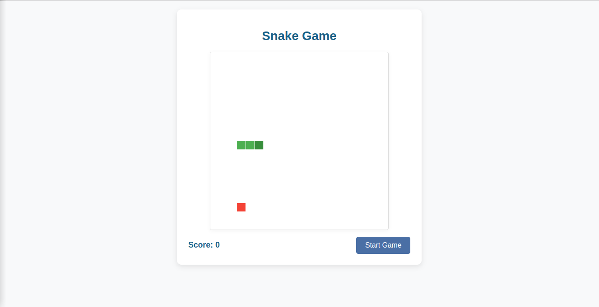

# 🐍 TypeScript Snake Game



A modern implementation of the classic Snake game built with TypeScript.

## 🎮 HOW TO PLAY
### 🕹️ Controls
| Key | Action |
|-----|--------|
| ↑ Up Arrow | Move snake up |
| ↓ Down Arrow | Move snake down |
| ← Left Arrow | Move snake left |
| → Right Arrow | Move snake right |
| Space/Enter | Pause/resume game |

### 🎯 Game Rules
1. Control the snake using arrow keys
2. Collect 🍎 **green apples** to score points
3. For each apple:
   - Score increases by +10 points
   - Your snake grows longer
4. ❌ **Avoid**:
   - Hitting walls
   - Crashing into your own tail

## 🚀 INSTALLATION
```bash
git clone https://github.com/jovialpiglet/snake-game.git
cd snake-game
npm install  # Install dependencies
npm run dev  # Start development server
